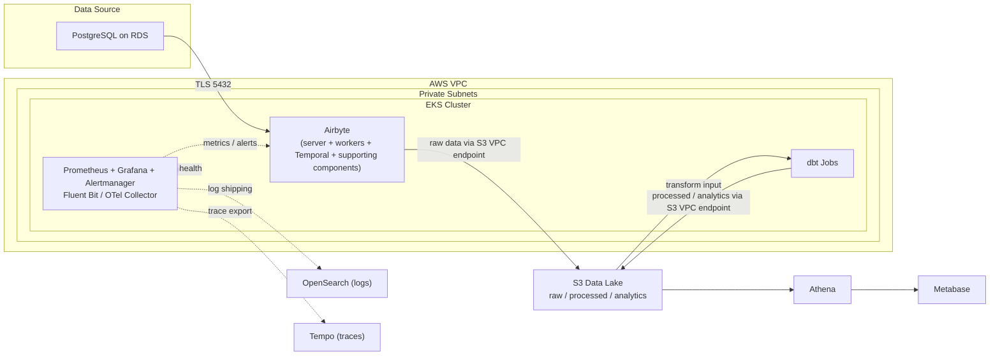

# SeQura Data Platform Engineer Technical Challenge (v2.3)

## Final Delivery Report

### Candidate
- Name: `Juan Manuel Cristóbal Moreno`
- Date: `16-03-2026`
- Repository: `https://github.com/juanmcristobal/data-platform-challenge`

---

## 0. Executive Summary

This submission implements a pragmatic end-to-end data ingestion platform with Infrastructure as Code, based on Kubernetes, Airbyte, PostgreSQL, and a local S3-compatible destination (MinIO in this demo).

The solution is split into:
- **Platform layer** (`infra/services`): namespaces, Airbyte, PostgreSQL, MinIO, buckets.
- **Pipeline layer** (`pipelines`): reusable Pipeline-as-Code for Airbyte.

Main goals achieved:
- PostgreSQL deployed as Airbyte source with declarative DB object management (users, schemas, tables, grants).
- Airbyte deployed and connected to PostgreSQL with verified end-to-end sync.
- Network isolation controls on PostgreSQL ingress (port `5432`) with automated positive/negative validation.
- Reusable Airbyte pipeline creation with schedule every 6 hours and `full_refresh_overwrite`.
- Scalable structure to add 30+ pipelines by adding one YAML file per pipeline.
- S3 storage module supports both MinIO (local demo) and AWS S3 (production) via `backend_type` switch, with both paths validated by Terraform module tests (plan/assert level, no live AWS provisioning in this submission).

Operational evidence in this delivery:
- Airbyte source/destination/connection created and sync executed successfully against PostgreSQL -> MinIO.
- Network validation executed with both expected outcomes: allowed traffic from `airbyte` namespace and denied traffic from a non-allowed namespace.

Scope choices:
- Local environment uses `kind` + `Terragrunt` + `Terraform` + `Cilium` as CNI.
- S3 destination is implemented via MinIO (S3-compatible) for local reproducibility. No real AWS S3 resources are provisioned in this submission.
- Production-grade upgrades (strict secret backend, IRSA, CI/CD) are documented in design sections.

---

## 1. Time-Box and Prioritization

Target challenge distribution:
- Part 1: 35 min
- Part 2: 45 min
- Part 3: 40 min

Result against time-box:
- Core functional scope for Parts 1 and 2 was completed end-to-end (infrastructure, connectivity, security controls, and pipeline provisioning flow).
- Part 3 production-hardening items were addressed as design decisions and documented rollout guidance, not fully automated in this submission.

Actual focus and prioritization:
- Prioritized **working IaC + connectivity/security controls** over complete production hardening automation.
- Prioritized **reusable pipeline design** over one-off static pipeline provisioning.
- Prioritized **dual-backend S3 module** (MinIO + AWS path) over deploying only one or the other.
- Documented trade-offs explicitly where local demo decisions differ from production expectations.

What I intentionally de-prioritized:
- CI/CD pipeline (GitHub Actions / GitLab CI) — the Makefile and Terragrunt roots are CI-ready but no workflow file is included in this delivery.
- Policy-as-code guardrails (OPA/Conftest) for pipeline YAML validation — described in design, not implemented yet.
- Full Airbyte webapp deployment — currently disabled in this delivery (`webapp_enabled = false`), keeping API-only mode for lower cluster footprint; it can be enabled through module inputs if needed.

---

## 2. Part 1 — The First Pipeline

### 2.1 — PostgreSQL Deployment

#### Implementation
- Entry point: `infra/services/03-postgres/terragrunt.hcl`
- Module: `infra/modules/postgres-service/`
- PostgreSQL deployed with Helm (`bitnami/postgresql`), chart version pinned (`18.5.6`), persistence enabled.
- Database objects managed declaratively from HCL:
  - DB: `airbyte_source_db`
  - Users: `app_owner` (DDL owner), `airbyte_reader` (read-only ingestion user)
  - Schema: `public`
  - Tables: `bank_customers`, `card_transactions` (created via Kubernetes Job with templated SQL)
  - Grants: `airbyte_reader` restricted to `SELECT` only, with default privileges for future tables
- NetworkPolicies deployed as part of the same module (see 2.3a below).
- Terraform tests: `infra/modules/postgres-service/tests/postgres_service.tftest.hcl`

#### Why this strategy
- Single Terraform module centralizes Postgres deployment + DB model + network controls.
- Adding new databases, users, schemas, or tables is a data-driven operation (add to `variables`), not code duplication.
- Table creation via Kubernetes Job avoids requiring direct TCP connectivity from the Terraform runner to PostgreSQL for DDL, keeping the security posture clean.

#### Trade-offs
- Local administration path via NodePort is optimized for reproducibility on `kind`, not for production networking posture. In production, PostgreSQL would be AWS RDS in a private subnet, managed by a CI/CD runner inside the VPC.
- `pg_hba.conf` hardening (scram-sha-256, explicit host allowlists) is documented but not applied in the demo chart.

---

### 2.2 — Airbyte Deployment

#### Implementation
- Entry point: `infra/services/02-airbyte/terragrunt.hcl`
- Module: `infra/modules/airbyte/`
- Airbyte OSS deployed via Helm chart, version pinned.
- Resource requests/limits configured per component (server, worker, workload-launcher, workload-api-server, temporal, bootloader).
- Webapp currently disabled via module input (`webapp_enabled = false`), running in API-only mode for lower local resource footprint.
- Airbyte API accessed locally via `make port-forward-airbyte`.
- Terraform tests: `infra/modules/airbyte/tests/airbyte.tftest.hcl`

#### Why this strategy
- Helm chart is the fastest stable path to deploy the full Airbyte control plane in Kubernetes.
- Pinned chart version ensures reproducibility. Resource limits prevent noisy-neighbor problems in a shared cluster.

#### Trade-offs
- Community edition; no built-in RBAC or multi-tenant workspace isolation. Production would evaluate Airbyte Cloud or add an auth layer (Keycloak can be enabled in the chart).

---

### 2.3 — Connectivity & Security

#### 2.3.a — Ensure only Airbyte can access PostgreSQL on 5432

##### Implemented controls
- Dedicated namespaces with separation of concerns:
  - `airbyte` — application / ingestion workloads
  - `data-source` — database
  - `minio` — object storage
- **Cilium** deployed as CNI to enforce NetworkPolicies at the kernel level.
- `NetworkPolicy` in `data-source` namespace:
  - `postgres-default-deny-ingress`: blocks all ingress to PostgreSQL pods by default.
  - `postgres-allow-clients`: explicitly allows TCP/5432 only from pods in namespaces listed in `allowed_client_namespaces` (default: `airbyte`).
- DB least-privilege:
  - `airbyte_reader` role: `LOGIN`, no `SUPERUSER`/`CREATEDB`/`CREATEROLE`. Only `SELECT` on specified tables, plus `CONNECT` to `airbyte_source_db` and `USAGE` on `public` schema.
  - Default privileges granted so future tables created by `app_owner` are also readable by `airbyte_reader`.

##### Validation
- `make validate-network` runs automated connectivity tests:
  - **Positive test**: pod in `airbyte` namespace connects to PostgreSQL on `5432` → **succeeds**
  - **Negative test**: pod in temporary `netcheck-debug` namespace connects to PostgreSQL on `5432` → **connection timed out** (blocked by policy)
- Evidence logged in `docs/installation-guide.md` with real CLI output and validation commands.

##### Local demo note
- `allowed_admin_cidrs` includes broad CIDRs to allow the Terraform PostgreSQL provider (running on the host) to reach PostgreSQL via NodePort during `terraform apply`. This is a local-only operational escape hatch.
- In production, Terraform runs from a CI/CD runner inside the VPC (GitHub Actions self-hosted runner, Atlantis pod), making broad CIDRs unnecessary. The PostgreSQL source would be AWS RDS in a private subnet, reachable only from the EKS worker node security group.

---

#### 2.3.b — Airbyte worker pods stuck in Pending — troubleshooting approach

Troubleshooting checklist used/documented (ordered from most immediate to most infra):

| # | Check | Command | What it reveals |
|---|-------|---------|-----------------|
| 1 | Scheduler reason | `kubectl describe pod <worker-pod> -n airbyte` | Direct cause of `Pending` (insufficient resources, taints, affinity, PVC, etc.) |
| 2 | Events stream | `kubectl get events -n airbyte --sort-by=.lastTimestamp` | Recent scheduling failures, image pull errors, quota rejections |
| 3 | Node resources | `kubectl describe nodes` | CPU/memory pressure, `Allocatable` exhaustion, node conditions |
| 4 | PVC status | `kubectl get pvc -n airbyte` | Unbound PVCs blocking pod scheduling |
| 5 | Taints & tolerations | `kubectl get nodes -o custom-columns=NAME:.metadata.name,TAINTS:.spec.taints` | Taint/toleration mismatches preventing scheduling |
| 6 | Autoscaler logs (if installed) | `kubectl logs -n kube-system deploy/cluster-autoscaler --tail=200` | Why scale-out did not trigger |
| 7 | Quotas/limits | `kubectl get resourcequota,limitrange -n airbyte` | Namespace-level restrictions blocking admission |

---

## 3. Part 2 — Scaling to 30 Pipelines

### 3.1 — S3 Destination

#### Implementation
- Local S3-compatible destination deployed with MinIO:
  - Service: `infra/services/04-minio/`
  - Buckets: `infra/services/05-minio-buckets/`
  - Module: `infra/modules/minio-buckets/`
- Buckets created as code:
  - `data-lake-raw`
  - `data-lake-processed`
  - `data-lake-analytics`
- The inner module `infra/modules/minio-buckets/modules/data_lake_buckets/` supports **two backends**:
  - `backend_type = "minio"` — raw `aws_s3_bucket` resources against MinIO endpoint (used in this demo).
  - `backend_type = "aws"` — uses the community `terraform-aws-modules/s3-bucket/aws` module with:
    - Versioning enabled
    - SSE-S3 server-side encryption
    - Deny-insecure-transport policy
    - Require-latest-TLS policy
    - Public access block
- Both paths validated with Terraform tests:
  - `infra/modules/minio-buckets/tests/minio_buckets.tftest.hcl` (MinIO path)
  - `infra/modules/minio-buckets/tests/data_lake_buckets_aws.tftest.hcl` (AWS path via `override_module`)
  - `infra/modules/minio-buckets/modules/data_lake_buckets/tests/data_lake_buckets_aws_path.tftest.hcl` (inner module, both paths)

#### Strategy and trade-off
- No AWS account available for this challenge. MinIO provides full S3 API compatibility for end-to-end validation.
- The AWS S3 code path already exists in the module and is tested. Switching to real AWS S3 in production requires:
  1. Expose `backend_type` as a service input (currently wired to `"minio"` in `infra/modules/minio-buckets/main.tf`) and set it to `"aws"`.
  2. Supply real AWS credentials (via IRSA or environment).
  3. Optionally add lifecycle rules for storage tiering (IA → Glacier), which can be added to the `aws_bucket` module call.

---

### 3.2 — Airbyte Pipeline as Code

#### Implementation
- Pipeline root: `pipelines/airbyte/terragrunt.hcl`
- Reusable module: `pipelines/modules/airbyte-pipelines/`
- Catalog-based definition: `pipelines/airbyte/pipelines/*.yaml`
- Template for new pipelines: `pipelines/airbyte/pipelines/examples/pipeline-template.yaml`
- Active pipeline example:
  - Source: PostgreSQL (`airbyte_source_db.public`)
  - Destination: MinIO bucket `data-lake-raw` with prefix `banking/demo`
  - Schedule: every 6 hours (Quartz cron `0 0 0/6 * * ?`)
  - Sync mode: `full_refresh_overwrite`

#### How it works
1. Each pipeline is defined in a single YAML file under `pipelines/airbyte/pipelines/`.
2. The Terraform module uses `fileset()` to auto-discover all `*.yaml` files in the directory.
3. Each YAML is parsed with `yamldecode()` and merged into a pipeline map.
4. `for_each` iterates the map and creates `airbyte_source`, `airbyte_destination`, and `airbyte_connection` resources for each pipeline.

#### Scalability design (#2, #3, ... #30)
- Adding a new pipeline = copying the template YAML, editing source/destination/schedule, opening a PR.
- No module code changes required. No Terraform variable block edits.
- Built-in validations in the module:
  - Unique `pipeline_key` enforcement
  - Required fields check (host, database, bucket, etc.)
  - Quartz cron format validation
  - Allowed `sync_mode` values for typed `var.pipelines` inputs (YAML path currently relies on defaults and provider-side validation)

#### Secrets management
- **Current demo**: credentials in pipeline YAML files as `change-me-*` placeholders. Each file includes a header comment documenting the production pattern.
- **Production approach** (documented in `pipelines/airbyte/README.md § Secrets`):
  ```
  AWS Secrets Manager → External Secrets Operator → Kubernetes Secrets → Terragrunt get_env() → Terraform
  ```
  - Credentials stored in Secrets Manager under `sequra/data-platform/<team>/<pipeline-key>/`
  - Synced to K8s Secrets via External Secrets Operator
  - Injected into Terragrunt at plan/apply time via `get_env()` or CI/CD variables
  - Alternative: SOPS + age for encrypted-at-rest YAMLs in the repo

---

### 3.3 — Self-Service & Multi-Account

#### a) Self-service data platform

At SeQura we want teams to own their ingestion pipelines without depending on the platform team for every change.

**Current implementation in this repo:**
Teams can add ingestion pipelines by contributing a YAML file under `pipelines/airbyte/pipelines/`, following the provided template. The Terraform module auto-discovers and provisions all pipelines. In practice, teams can onboard new pipelines without changing shared module code; repository review policies still apply.

**Scope note:** the challenge time-box is focused on a working self-service technical baseline. Full enterprise GitOps operating model is documented as a future evolution, not as a delivery requirement for this submission.

**Target operating model for production (future evolution):**

1. **Pipeline-as-Code with GitOps**: each team defines pipelines in declarative YAML files following a standard template maintained by the platform team. CI/CD validates, plans, and applies automatically on merge. The platform team maintains the automation and contract, not individual pipelines.

2. **Guardrails enforced in CI**: every PR is validated against policies before deployment. Examples:
   - `owner` field is mandatory (maps to a team in PagerDuty/Slack).
   - Naming conventions enforced (`<team>_<dataset>_to_<destination>_<layer>`).
   - PII/data classification tags required for regulated datasets.
   - Schedule must be within allowed ranges (e.g., no sub-minute syncs).
   - Destination must be an approved bucket/prefix.
   - If all checks pass, the pipeline deploys without manual platform team intervention.

3. **Secrets and permissions scoped per team**: each team manages their credentials under a team-specific path in the secrets backend (`sequra/data-platform/<team>/`). IRSA roles and bucket prefix policies are scoped per team. Teams get observability dashboards filtered to their own pipelines for operational autonomy.

4. **Multi-account extension**: in a multi-account AWS setup (via AWS Organizations), each team or environment gets a dedicated account. Cross-account S3 access is granted via bucket policies + IAM role assumption. SCPs enforce guardrails at the organization level (no public buckets, enforce encryption, restrict regions).

---

## 4. Part 3 — Production at Scale

### 4.1 — Architecture Diagram

The production architecture extends the initial pipeline into an AWS-based, scalable data platform with clear runtime, security and observability boundaries.

**Data flow**: PostgreSQL source → Airbyte on EKS → S3 raw zone → dbt jobs on EKS → S3 processed/analytics zones → Athena → Metabase dashboards.

**Runtime boundaries**:

* **Inside EKS**: Airbyte (server, workers, Temporal, and supporting components), dbt jobs, observability components (Prometheus, Grafana, Alertmanager, Fluent Bit / OpenTelemetry Collector).
* **AWS-managed services**: RDS for PostgreSQL, S3 data lake, OpenSearch, Secrets Manager, KMS, CloudWatch, CloudTrail.

**Security boundaries**:

* Workloads run in **private subnets** inside a VPC.
* **VPC Endpoints** are used for S3, STS, Secrets Manager and ECR to avoid unnecessary public egress.
* **Security Groups** restrict PostgreSQL access on port 5432 to the EKS worker nodes only.
* **IRSA** provides per-ServiceAccount IAM roles, avoiding static AWS credentials inside pods.
* **NetworkPolicies** isolate namespaces and limit east-west traffic inside the cluster.
* **Encryption** is enforced with TLS in transit and SSE-KMS at rest for S3 and RDS.
* **CloudTrail** provides audit logging for AWS API activity.



**Why this architecture**:

* It keeps the platform pragmatic: managed services are used where they reduce operational burden (RDS, S3, KMS, Secrets Manager).
* EKS is used only for the components that benefit from Kubernetes scheduling and repeatable deployment (Airbyte, dbt, observability).
* S3 + Athena is a cost-efficient baseline for analytics, while still leaving room to evolve toward Redshift later if concurrency or performance requirements increase.

---

### 4.2 — Observability & Monitoring

The observability strategy is designed to detect both **infrastructure failures** and **data quality / freshness issues** before business users notice stale dashboards.

#### What is monitored

| Layer | Key metrics / signals |
| --- | --- |
| EKS | Node CPU/memory pressure, pod Pending state, CrashLoopBackOff, restarts, failed scheduling events, PVC usage |
| Airbyte | Sync success/failure rate, sync duration p95, worker availability, queued/running jobs, records/bytes synced |
| PostgreSQL (RDS) | Connectivity, active connections vs max, CPU, memory, storage, connection errors/timeouts |
| S3 | Successful object writes, bucket growth, abnormal drop in landed files, request errors |
| Data freshness | `now() - last_successful_sync` per pipeline; age of latest raw and processed partitions |
| Logs | Airbyte worker errors, dbt failures, Kubernetes events, container startup failures |
| Alerts / incidents | Failed syncs, freshness breaches, worker instability, PostgreSQL saturation |

#### How it is implemented

* **Metrics**: Prometheus collects Kubernetes and application metrics using `kube-state-metrics`, `node-exporter`, and Airbyte metrics/exporters where available. CloudWatch metrics for RDS and S3 are integrated into Grafana.
* **Dashboards**: Grafana provides operational dashboards per namespace, per pipeline and per component.
* **Tracing**: OpenTelemetry instrumentation/exporters send traces to Tempo for distributed tracing analysis.
* **Logs**: Fluent Bit / OpenTelemetry Collector ships Kubernetes and application logs to OpenSearch for indexing and search.
* **Alerting**: Alertmanager routes alerts to Slack for platform visibility and PagerDuty for on-call incidents.
* **Freshness checks**: a scheduled check records the last successful Airbyte sync and latest raw/processed partition timestamps, turning freshness into a first-class monitoring signal.

#### Concrete alerts

| # | Alert | Condition | Severity | Who | Would catch Monday incident? |
| - | - | - | - | - | - |
| 1 | `AirbyteSyncFailuresHigh` | 2 consecutive scheduled sync failures for the same pipeline | P1 | On-call via PagerDuty | ✅ |
| 2 | `DataFreshnessBreach` | `last_successful_sync > 8h` for a 6h pipeline | P1 | On-call via PagerDuty + Slack | ✅ |
| 3 | `AirbyteWorkersPendingOrCrashing` | Airbyte worker pods Pending or in CrashLoopBackOff for >10 min | P2 | Platform team Slack | ✅ |
| 4 | `PostgresConnectionErrors` | Connection timeout/error rate above baseline for 10 min | P2 | Platform team Slack | ✅ |
| 5 | `RawZoneNotUpdated` | No new objects written to expected raw prefix after a scheduled sync window | P2 | Data platform Slack | ✅ |

Alerts 1–3 would likely have caught the incident on Friday night or Saturday morning, well before the data team noticed stale dashboards on Monday.

---

### 4.3 — Incident Troubleshooting

#### Approach: correlate first, then investigate individually

All three issues appeared in the same timeframe (Friday night to Monday morning), so the first step is to determine whether they are separate failures or symptoms of a single upstream problem.

The most likely scenario is a shared causal chain: worker instability in EKS prevented Airbyte from maintaining healthy source connectivity, which stopped ingestion, which in turn left downstream transformations and dashboards stale.

Note: the commands below are production-oriented examples and should be adapted to the actual namespace, deployment and resource names.

---

#### Issue 1: Metabase dashboards show stale Friday data

**What I would check first**

* Last successful Airbyte sync per affected connection
* Latest objects written to the relevant S3 raw prefixes
* Last successful dbt run and whether it failed or simply had no fresh input
* Timestamp of the final tables or views used by Metabase

**Most likely root causes**

* Airbyte syncs failed, so no new raw data reached S3
* dbt did not run, failed, or ran successfully but against stale inputs
* Freshness monitoring was missing or not alerting

**How I would resolve or escalate**

* Confirm the latest successful sync and whether raw data landed in S3
* Re-run the failed Airbyte sync after source connectivity is restored
* Re-run dbt after fresh raw data is present
* Validate final dataset timestamps before notifying the data team that dashboards are healthy again

```bash
kubectl -n airbyte logs deploy/<airbyte-worker-deployment> --since=72h | grep -E "sync|failed|completed"
aws s3 ls s3://<bucket>/raw/<prefix>/ --recursive | tail -20
kubectl -n data-ingestion logs job/dbt-run-nightly --previous
```

---

#### Issue 2: Airbyte shows failed syncs with connection timeout to PostgreSQL

**What I would check first**

* Basic connectivity from an Airbyte pod to PostgreSQL on port 5432
* DNS resolution of the PostgreSQL hostname from inside the cluster
* Recent Security Group or NetworkPolicy changes
* RDS events such as maintenance, failover or restart
* Whether credentials in Secrets Manager were rotated without being propagated

**Most likely root causes**

* Airbyte workers were unstable or restarting, interrupting connections
* PostgreSQL access on port 5432 was blocked by a Security Group change
* Source credentials became invalid after rotation
* RDS hit a limit or had a transient maintenance/failover event

**How I would resolve or escalate**

* Stabilise the worker pods first if they are unhealthy
* Revert any recent network rule changes
* Validate credentials and rotate/redeploy consumers if needed
* Escalate to the DB/platform owner if RDS events or infrastructure-level connectivity issues are confirmed

```bash
kubectl -n airbyte run netcheck --rm -it --image=busybox:1.36 -- sh -c "nc -zvw5 <pg-host> 5432"
kubectl -n airbyte run dnscheck --rm -it --image=busybox:1.36 -- nslookup <pg-host>
aws ec2 describe-security-groups --group-ids <rds-sg-id>
aws rds describe-events --source-identifier <db-instance-id> --duration 1440
aws secretsmanager get-secret-value --secret-id sequra/data-platform/pg-credentials
```

---

#### Issue 3: The EKS cluster has 5 pods in CrashLoopBackOff in the `data-ingestion` namespace

**What I would check first**

* `kubectl describe pod` to inspect restart reason and events
* Current and previous container logs
* Exit codes and probe failures
* Recent deployments or config changes on Friday
* Node resource pressure and scheduling health

**Most likely root causes**

* A bad deployment or broken image rolled out on Friday
* Missing or invalid environment variables / secrets
* OOMKilled containers due to incorrect memory requests/limits
* Dependency startup failures causing repeated crashes
* Liveness/readiness probes failing too aggressively

**How I would resolve or escalate**

* Roll back the most recent deployment if it correlates with the start of the issue
* Restore missing secrets or fix broken configuration
* Increase/fix resource requests and limits if OOMKilled
* Redeploy after validation and confirm pods become Ready
* Escalate to the owning team if the crashing service is not owned by the data platform team

```bash
kubectl -n data-ingestion describe pod <pod-name>
kubectl get events -n data-ingestion --sort-by=.lastTimestamp | tail -30
kubectl -n data-ingestion logs <pod-name> --previous
kubectl -n data-ingestion rollout history deployment/<deployment-name>
kubectl top nodes
```

---

#### How the 3 issues are potentially related

The most likely shared causal chain is:

```text
Friday deployment / config change
        ↓
Pods enter CrashLoopBackOff in data-ingestion (Issue 3)
        ↓
Airbyte workers become unstable or lose dependencies
        ↓
Connections to PostgreSQL time out (Issue 2)
        ↓
No successful syncs land fresh data in S3
        ↓
dbt has no fresh input or does not run successfully
        ↓
Metabase dashboards remain stale from Friday (Issue 1)
```

**How I would validate this hypothesis**

* Correlate timestamps across:

  * first pod crashes
  * first Airbyte sync failures
  * last successful S3 object write
  * last successful dbt run
* If the pod failures started before the connection timeouts and stale data, that strongly supports a single-root-cause incident rather than three unrelated issues.

**Post-incident improvements**

* Keep `DataFreshnessBreach` as a critical alert so stale dashboards are detected on Saturday, not Monday
* Add post-deploy smoke tests for Airbyte sync health and source connectivity
* Separate critical ingestion workers from less critical workloads
* Maintain runbooks for Airbyte, RDS connectivity and Kubernetes failure modes
* Review deployment controls to reduce the chance of a Friday-night config regression

---

## 5. Validation Evidence

### Core infrastructure
- Namespaces, Airbyte, PostgreSQL, MinIO, and buckets provisioned through Terragrunt/Terraform roots.
- All Terraform module tests pass: **8/8 test runs across 7 `.tftest.hcl` files in 6 modules** (namespaces, airbyte, postgres-service, minio, minio-buckets wrapper, data_lake_buckets inner module).

### Security/connectivity
- `make validate-network` proves:
  - ✅ Authorized connectivity from `airbyte` namespace
  - ✅ Denied connectivity from unauthorized namespace
- Evidence with real CLI output in `docs/installation-guide.md`.

### Pipeline
- Airbyte source/destination/connection provisioned as code from YAML.
- Connection scheduled every 6 hours with `full_refresh_overwrite`.
- Sync verified with data landing in S3-compatible object storage path.
- Evidence in `docs/installation-guide.md` (pipeline deployment and end-to-end validation sections).

---

## 6. Known Limitations and Next Steps

1. **AWS S3 switch**: the `data_lake_buckets` module already supports `backend_type = "aws"`. Next step is adding S3 lifecycle rules (Standard → IA → Glacier) and a production service root.
2. **Secret backend integration**: pipeline YAML credentials are demo placeholders. Production path (External Secrets Operator + Secrets Manager) is documented and ready to implement.
3. **CI/CD pipeline**: Makefile and Terragrunt are CI-ready. Add GitHub Actions workflow with `plan` on PR, `apply` on merge, environment promotion.
4. **Policy-as-Code**: add OPA/Conftest checks for pipeline YAML (owner, PII classification, naming conventions, schedule guardrails).
5. **Admin network access**: remove `0.0.0.0/0` admin CIDR escape hatch and run Terraform from an in-cluster runner or CI/CD runner inside the VPC.

---

## 7. Repository Map (Requirement → Code)

| Requirement | Code |
|-------------|------|
| Part 1.1 — PostgreSQL | `infra/services/03-postgres/terragrunt.hcl`, `infra/modules/postgres-service/` |
| Part 1.2 — Airbyte | `infra/services/02-airbyte/terragrunt.hcl`, `infra/modules/airbyte/` |
| Part 1.3a — Access control | `infra/modules/postgres-service/main.tf` (NetworkPolicies L345-441), `Makefile` (`validate-network`) |
| Part 1.3b — Pending diagnosis | This document §2.3b |
| Part 2.1 — S3 destination | `infra/services/04-minio/`, `infra/services/05-minio-buckets/`, `infra/modules/minio-buckets/` (dual-backend) |
| Part 2.2 — Pipeline as code | `pipelines/airbyte/terragrunt.hcl`, `pipelines/airbyte/pipelines/*.yaml`, `pipelines/modules/airbyte-pipelines/` |
| Part 2.3a — Self-service | This document §3.3 |
| Part 3.1 — Architecture | This document §4.1 |
| Part 3.2 — Observability | This document §4.2 |
| Part 3.3 — Troubleshooting | This document §4.3 |
| Tests | `infra/modules/*/tests/*.tftest.hcl` (8 test runs across 7 `.tftest.hcl` files in 6 modules) |
| Automation | `Makefile` (350+ lines, full lifecycle) |

---

## 8. Reviewer Notes

- This submission is intentionally pragmatic and time-box aligned.
- Decisions that are demo-local vs production-grade are explicitly called out in each section.
- The S3 destination module supports both MinIO and AWS S3 — no AWS account was available for this challenge, but the production code path exists and is tested.
- Secret management follows a documented production pattern (External Secrets Operator + Secrets Manager) even though the demo uses local placeholders.
- I can explain and defend each trade-off during the pairing discussion.
